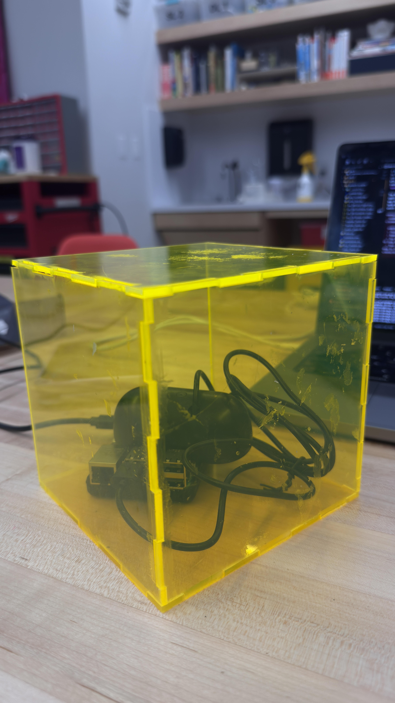

# Chatterboxes

**Jaclyn Pham (cqp4)
Vasudha Devkota (vd269)**

# Part 1

## Text to speech

The greeting shell script is `speech-scripts/jaclyn_piper.sh`.

In different voices, the speed of the greeting varies based on the annunciation of the word.

## Speech to text

On a clean 5.00s clip, base.en transcribed in 1.85s (real-time factor 0.37x) and small.en in 5.07s (RTF 1.01x), where RTF is processing time ÷ audio duration. base.en was actually the more accurate of the two here — it kept the digits and punctuation ("Testing, testing 1, 2, 3, testing.") while small.en spelled the numbers out and dropped punctuation ("testing one two three testing") — so the larger model cost ~2.7x the compute for a worse result. For a system that has to answer you, total latency (endpoint silence + transcription + reply + speech out) needs to stay under about 1–2 seconds or the pause reads as broken, so accuracy stops being worth the delay once a model's RTF approaches ~0.5x on the Pi. small.en at 1.01x blows that budget outright, making you wait the length of your own sentence again before it even replies. On the Pi I'd run base.en (or tiny.en) — especially for my mansplainer, where interruptions fire off the voice-activity detector rather than the transcript, so speed matters far more than transcription accuracy.

The number script asks for a phone number and records the answer:

```
Playing WAVE 'question.wav' : Signed 16 bit Little Endian, Rate 22050 Hz, Mono
Asked: "What is your phone number?"
Recording for 7s... speak now.
Recording WAVE 'answer.wav' : Signed 16 bit Little Endian, Rate 16000 Hz, Mono
Heard: "814-234-2301"
```

## Storyboard


## Physical prototype

For the first version, we laser-cut acrylic panels and assembled them into a box to house the hardware.



## Acting out the dialogue

[Watch the acted dialogue](https://drive.google.com/file/d/1ttRMjnYvQw7Z-ykoSRh3-XFp7Mjn5OIf/view?usp=sharing)

---

# Lab 3 Part 2

## Prep for Part 2

Part 1 was a device that interrupts you. Acting that out showed the timing was the whole joke, and also the whole problem: a person playing the device can hear the subject of the sentence, and a script cannot. The redesign is `speech-scripts/mini_sheldon.py`, an autonomous version on the Pi. It listens with the microphone, endpoints with Silero VAD, transcribes with faster-whisper, looks the subject up on Wikipedia, and answers in a British Piper voice (`en_GB-semaine-medium`).

Concrete changes from the acted version:

1. Wording. The interruption should sound like Sheldon Cooper, not a generic "fun fact," and it should be about the thing you actually said.
2. Timing. He jumps in on a short breath (0.2s), then stops and lets you finish one full statement (0.9s of quiet) instead of firing another fact on every pause.
3. Misunderstandings. Whisper will mishear. The reply has to survive a bad word, and there has to be an exit line he can still catch.

There is no separate screen or LED in this build. The only cue that he is listening is that he has stopped talking, and the terminal log is what I watched while testing. A light for "listening" versus "thinking" is the obvious next sensor, because right now a silence can mean either.

## Prototype your system

[Watch the prototype video](https://youtu.be/YPqgQmZB3vQ?si=2AJ5gfsSU0aY9WE3)

Run it from `speech-scripts` with the venv on:

```bash
python mini_sheldon.py --model base.en
```

The microphone is the sensor. One turn looks like this:

1. While you are still talking, a side thread transcribes the audio so far and prints `(hearing)`.
2. A 0.2s pause is your breath. If that transcript has a subject, he speaks a Sheldon opener plus the first sentence of the matching Wikipedia page.
3. He then waits. Breaths in the middle of your answer are not new facts. After 0.9s of quiet he prints `(heard you)` and arms the next interruption.
4. "Goodbye Sheldon, you are annoying" (or a close mishear that still has "Sheldon" plus "goodbye" or "annoying") makes him say the exit line and quit.

The subject is the last content words, not the longest word. "I keep thinking about black holes" looks up `black holes`.

```python
def _subject_phrase(heard: str | None) -> str | None:
    if not heard:
        return None
    words = _content_words(heard)
    if not words:
        return None
    return " ".join(words[-2:])
```

The exit line is fixed, and the match is loose on purpose because Whisper rarely returns the sentence exactly.

```python
GOODBYE_LINE = "You'll be back. Knowledge is addictive. Bazinga."

def _is_goodbye(heard: str | None) -> bool:
    if not heard:
        return False
    text = re.sub(r"good\s*bye", "goodbye", heard.lower())
    words = set(re.findall(r"[a-z']+", text))
    bye = "goodbye" in text or "bye" in words
    return "sheldon" in words and (bye or "annoying" in words)
```

## Test the system

I tested by talking to it on the Pi and reading the terminal log, which is the controller for this build: there is no separate wizard UI. The log is how you see what he heard versus what he said.

### What worked well about the system and what didn't?

**What worked**

- The voice. `en_GB-semaine-medium` plus the short Sheldon openers ("Well, actually.", "Correction.", "Bazinga.") made the same interruption feel like a character. A fact with no opener just sounded like a speaker reading Wikipedia.
- Live lookup. A hardcoded fact table only knew the words I had typed in. Wikipedia's summary API covers whatever noun he actually caught, with the canned paraphrase only as a fallback when the page is missing.
- The turn shape. After one fact he prints `(your turn - I'll wait until you finish)` and waits through breaths. That matched the storyboard better than pouncing every 0.2s.
- Keeping the live transcript. `(hearing)` was usually the best text the system had. Using that line, instead of starting a second Whisper pass and blocking the microphone, stopped the "it gets worse every turn" failure.

```python
def take(self, final: np.ndarray) -> str | None:
    # ...
    with self._cv:
        if self._heard:
            text = self._heard
            self._clear_locked()
            return text
        # only decode from scratch when nothing has been heard yet,
        # and only wait 0.6s so the mic read is not stalled
```

**What did not**

- The first lookup rule was "longest word." That is not the subject. On a Pi test, "wait" and a bad fragment became pages about Goshen, Indiana and Thanksgiving, because a Wikipedia search will always return *some* popular page. A later check refuses a title that shares no word with what was said.
- He talked over himself. The mic stays open during Piper playback, so the next "you said" was his own previous sentence ("stay and not. The extra detail doesn't change the claim."), and the following facts were paraphrases of that. Playback audio now gets discarded, and a transcript that overlaps the line he just spoke is ignored.
- Empty clips still triggered speech. A breath the VAD counted as a turn, with no Whisper text, produced only an opener: `That's incorrect.` or `In point of fact.` Those clips are now skipped.
- `base.en` is more accurate than `tiny.en` on a file, and too slow for a second full decode on the Pi. The old `take()` deleted the `(hearing)` line, waited 2.5s, gave up, and printed `(still catching) ...` even when the log had already shown "thinking about black holes." While it waited it was not reading the mic, so the next sentence was dropped too. That is why transcription looked like it decayed.
- The goodbye line is brittle. One test heard "shouted you are annoying" and looked up Annoyance, because "Sheldon" never made it into the transcript. The trigger cannot fire on "annoying" alone without also catching ordinary sentences about being annoyed.
- He still interrupts on the first content word. "I keep thinking about black holes" became a fact about "thinking," because 0.2s of silence after that word was enough. Waiting for a subject helps only when the noun has already been said.

### What worked well about the controller and what didn't?

The controller here is the terminal log plus the two timing flags, `--min-silence` and `--listen-silence`. There is no wizard screen.

What worked: `(hearing)` updating while I was still talking made the device's state visible. I could tell "he has the subject" from "he is about to guess" before he spoke. Printing the lookup in the reply line, `(you paused) [black holes] -> ...`, made a wrong fact debuggable instead of mysterious.

What did not: `(still catching) ...` and `(no subject in that, still here)` do not say *why* the text was empty, so for a while I thought the model was getting worse rather than the mic loop stalling. A real controller would show listening versus thinking as a light, not as a line I have to read over SSH.

### What lessons can you take away from the WoZ interactions for designing a more autonomous version of the system?

When a person played the device in Part 1, they interrupted on the *point* of the sentence and then let the other person answer. The autonomous version's first instinct was to interrupt on any pause and reply from any word. Those are different behaviors, and only the first one is the character.

The acted dialogue also hid three things a person does without noticing: they do not respond to their own voice, they do not answer a silence, and they recognize "goodbye" even if the wording is slightly off. Each of those had to be written down explicitly or the Pi did the opposite. The useful lesson is that the wizard's policy is mostly turn-taking and refusal, not the clever sentence. The Wikipedia sentence was the easy part.

### How could you use your system to create a dataset of interaction? What other sensing modalities would make sense to capture?

The log is already a dataset of turns: the live partial, the text he committed to, the Wikipedia phrase, and whether he spoke, waited, or signed off. Saving each VAD clip next to that line would make it a speech dataset instead of a text log, which is what you would need to measure how often `base.en` drops the subject.

The modality I most want besides the mic is a single LED, or a face on the small screen, with two states: listening, and speaking. Right now the only way to know which one he is in is to wait and see if he talks. A button held while you want the floor would also mark "I was not done" in the log, which is the label the 0.2s endpoint does not have.
